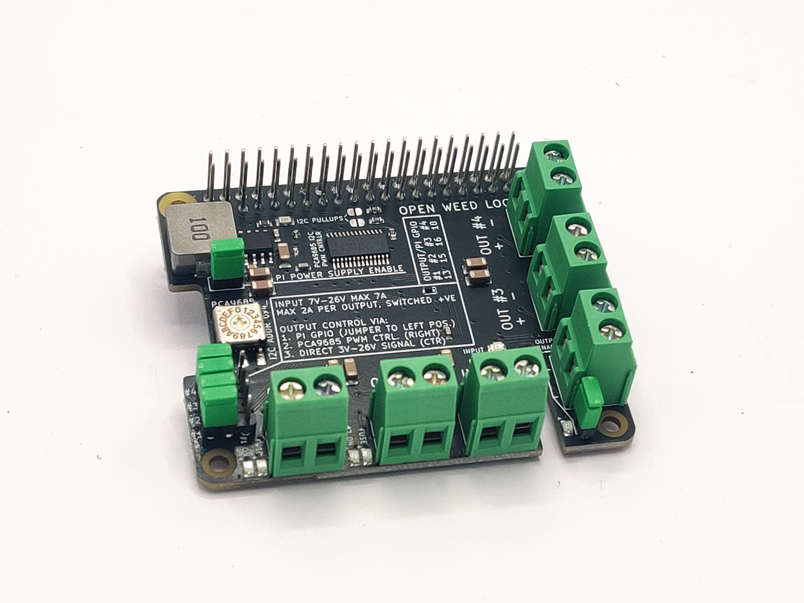
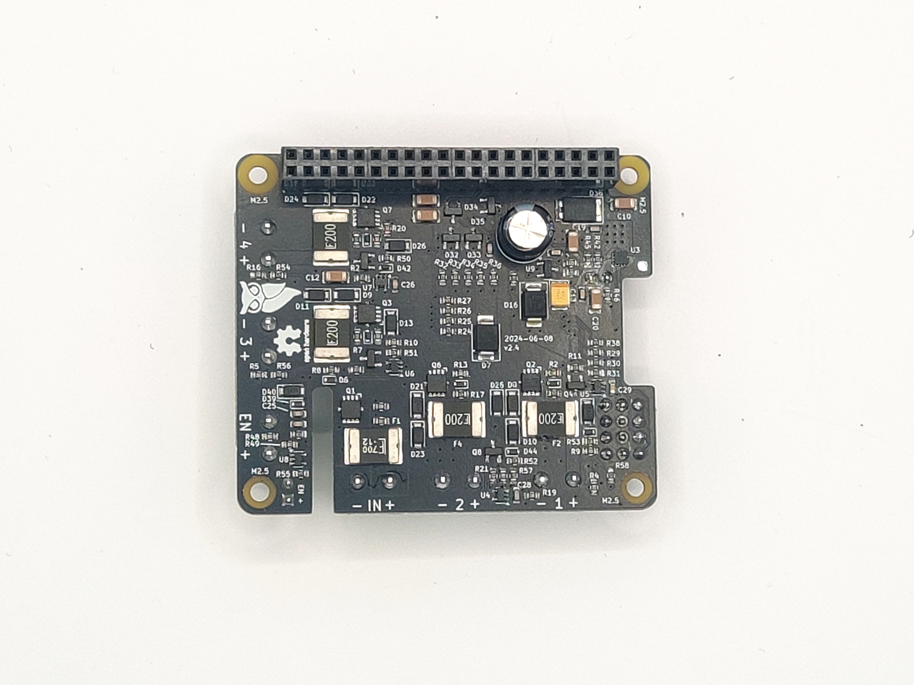
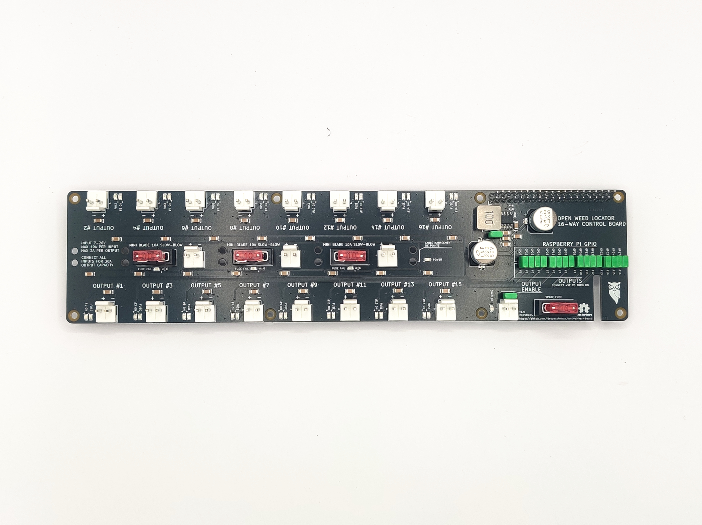
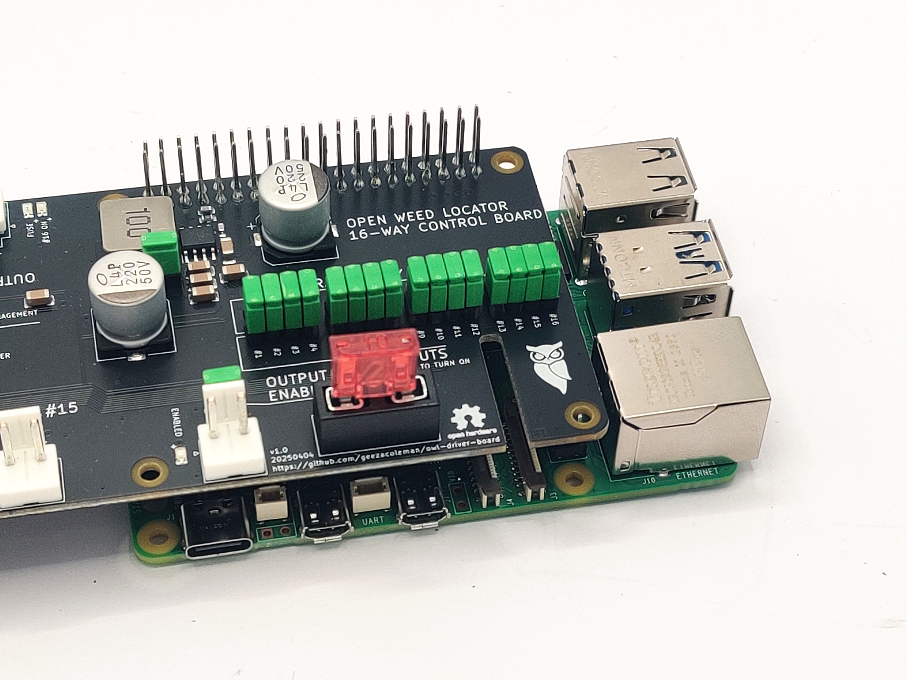
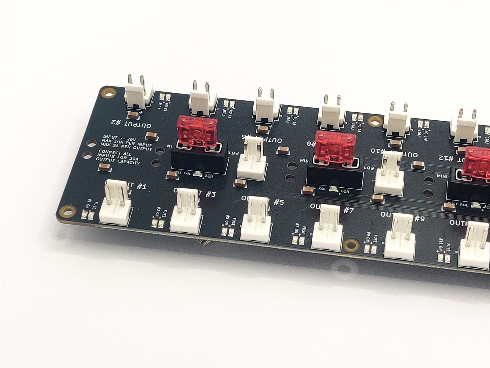

 

The OWL Driver Board is a solid-state relay HAT for the Raspberry Pi. It was
developed for use with the [Open Weed Locator](https://github.com/geezacoleman/OpenWeedLocator) 
but is suitable for any high-power, industrial, automotive or agricultural application.

It allows a Raspberry Pi to drive either 4x or 16x 2A outputs in any 12V or 24V
system, with the solid state switching allowing PWM control, including for
dimming LED strips. Outputs can be placed in parallel for more power if needed.

It is able to tolerate high levels of electrical noise, reverse polarity, short
circuit conditions and over voltage. It also protects the Pi from all this
electrical nastiness and provides a filtered source of 5V @ 5A!

It's ideal for use safely driving LED strips, high power motors, relays and
solenoids from a Raspberry Pi.

The board aims to be difficult to misconfigure and hard to damage.
Self-resetting polyfuses on the input and outputs limit current, and
TVS+Schottky diodes provide reverse polarity protection, protection against
noise and inductive voltage spikes, and over-voltage protection. This
protection also extends to communication buses with the Raspberry Pi.

# Features

### Both models (4x and 16x output versions)

* Open Hardware, made in the UK: schematics and design files freely available.
* Working voltage 7-26V
* 4x or 16x fused outputs, each max. 2A, high-side switched
* 1x e-stop / global enable input
* Outputs can be driven in multiple ways, configurable by a header
* From Raspberry PI GPIOs
* Directly from external control, via wires to a header. Control inputs are tolerant up to 26V.
* Buck converter generates 5.1V @ 3A continuous / 5A burst to power the Raspberry Pi (Pi 5 compatible!)
* Input and outputs are fused, with protection against over-voltage, reverse polarity, and inductive spikes
* LED indication of blown fuses

### Additional features for the 4x output version only

* 1x fused input max. 7A
* Self-resetting input polyfuse
* Integrated PCA9685 PWM driver allows optional PWM control via I2C, compatible with Adafruit PCA9675 Python libraries
* Input and output connectors use high-quality Phoenix Contact screw terminals
* Version 2.4

### Additional features for the 16x output version only

* 10x fused inputs max. 10A each (connect all inputs in parallel for 30A total board input power)
* 10A mini-blade fuses on inputs
* Spare fuse holder (including spare fuse)
* Inputs and outputs use JST VH connectors
* Version 1.0

# Purchase a finished board

You can buy a finished board (4x or 16x output versions) via the following distributors:

 * [paradar.co.uk](https://paradar.co.uk/products/owl-driver-board-raspberry-pi-automotive-relay-hat)

# Changelog

## 16x v1.1

* Correctly connect the input connectors to the input fuses.

## 16x v1.0

* Initial prototype of a 16-output version of the PCB. Note the Gerbers for
  this version have a bug - the input connectors are not attached to the fuse
  input, and a link must be manually soldered.

## 4x v2.4

* Add an "output enable" terminal (J10) for use with an emergency stop switch.
  Outputs are enabled when the terminal is shorted; they are disabled when it
  is disconnected.

## 4x v2.3

* Improved Pi regulator efficiency (81% -> 87%) to reduce heat generated when
  driving a Raspberry Pi 5

## 4x v2.2

* Change out the switching buck regulator from a 2A max limit to a 5A model.
  Increase the regulation voltage from 5.0V -> 5.1V to drive a Raspberry Pi 5
  without undervoltage warnings.
* Add a LM73100 ideal diode on the Pi 5V output to ensure there is no backflow
  of current from the Pi into the board when powered off, and the Pi has a
  separate USB-C power supply.

## 4x v2.1

* Add a slot for the Raspberry Pi camera connector, to allow the ribbon cable
  to easily pass through the driver board.
* Remove stacking power connector to allow space for the cable slot. If
  stacking is required, board power inputs should be wired in parallel.
* Fix major error in v2.0 where MOSFET rotations were incorrect
* General manufacturability improvements (component polarity in silkscreen)

## 4x v2.0

* Significantly rework layout to allow space for instructions on the top. Move
  most components to the bottom layer.
* Change MOSFETs from TO-220 to a compact SMD footprint.
* Add indicator LED to each output and the power input.
* Switch to generic spring connectors that are PTH rather than SMD; the Wago
  SMD connectors did not hold up well in use.
* Change diodes from SMA to DO-123F to save space.
* Change most resistors from 0805 to 0603 to save space.

## 4x v1.0

Initial prototype.

# Schematic and layout

KiCanvas links:

 * [Schematic](https://kicanvas.org/?github=https%3A%2F%2Fgithub.com%2Fgeezacoleman%2Fowl-driver-board%2Fblob%2Fmain%2Fpcb%2Fowl-driver-board.kicad_sch)
 * [Layout](https://kicanvas.org/?github=https%3A%2F%2Fgithub.com%2Fgeezacoleman%2Fowl-driver-board%2Fblob%2Fmain%2Fpcb%2Fowl-driver-board.kicad_pcb)

# License

This open hardware project is Copyright (c) 2022 Guy Coleman and Patrick Coleman, and is released under an MIT license.

# Stacking

The HATs may be stacked and controlled with the PCA9685 by selecting different
I2C addresses for each board in the stack. In this configuation, the input power
terminals should be wired in parallel. Ensure that the wires used are rated for
sufficient current.

When stacked and in GPIO mode, turning on output #1 from the Raspberry Pi will
turn on all #1 outputs in the stack.

For individual control of all outputs in the stack
1. Set jumpers on header J6 to control outputs via the PCA9685 (the "PWM" setting).
1. Set SW1 to select a different address for each board in the stack.
1. Use the Adafruit PCA9685 Python library on the Raspberry Pi to communicate
   with each board via the chosen I2C addresses and control outputs
   individually.

Pi pin 22 (GPIO25) is connected to the PCA9685 Output Enable pin. Driving this
pin high on the Pi will disable all outputs in the stack (eg, for a software
emergency stop). It must be driven low for normal operation.

# Manufacturing

The project is set up for easy manufacture and assembly with JLCPCB, though it
will work with other suppliers too. All components should be available at
JLCPCB/LCSC and LCSC part numbers are included in KiKad fields for each part.

If you are having JLCPCB assemble the boards for you, you must manufacture in
panels (two boards per panel), as the board is too small for assembly alone. If
you will be assembling yourself, use pcb/gerbers/gb-owl-driver-board.zip for a single board.

1. Upload pcb/gerbers-panel-v2.4/gb-owl-driver-board-v2.4.zip to [JLCPCB's order tool](https://cart.jlcpcb.com/quote)
1. Configure the PCB manufacture settings to your requirements. Select "Confirm production file: Yes"
1. Select SMT assembly, and configure as follows: "Standard" assembly, "Both sides", and "Confirm production file". Click Confirm.
1. When prompted, upload the BOM (pcb/owl-driver-board_bom_jlc.csv) and Component Placement/CPL (pcb/owl-driver-board_cpl_jlc.csv) files.
1. Complete the SMT assembly wizard, aligning the parts to the board if necessary.

