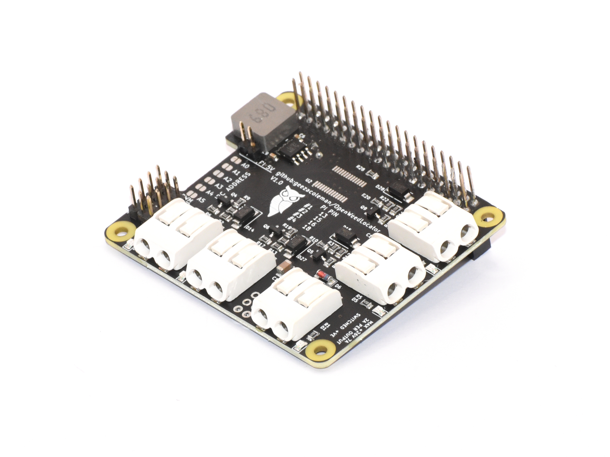

The OWL Driver Board is a solid-state relay HAT for the Raspberry Pi. It was
developed for use with the [Open Weed Locator](https://github.com/geezacoleman/OpenWeedLocator) 
but is suitable for any automotive or agricultural application.

It allows a Raspberry Pi to drive 4x 2A outputs in any 12V or 24V system. It is
able to tolerate high levels of electrical noise, reverse polarity, short
circuit conditions and over voltage.

 * Working voltage 7-26V
 * 4x fused outputs, each max. 2A, high-side switched
 * 1x fused input max. 7A
 * Integrated PCA9685 PWM driver allows optional PWM control, compatible with Adafruit PCA9675 Python libraries
 * Outputs can be driven in multiple ways, configurable by a header
   * From Raspberry PI GPIOs
   * From an on-board PCA9685 PWM driver
   * Directly from external control, via wires to a header. Control inputs are tolerant up to 26V.
 * Buck converter generates 5V @ 2A to power the Raspberry Pi
 * Input and output connectors use WAGO spring terminals
 * Input and outputs are fused, with protection against over-voltage, reverse polarity, and inductive spikes
 * LED indication of blown fuses

The board aims to be difficult to misconfigure and hard to damage.
Self-resetting polyfuses on the input and outputs limit current, and TVS+Schottky
diodes provide reverse polarity protection, protection against noise and
inductive voltage spikes, and over-voltage protection. This protection also
extends to communication buses with the Raspberry Pi.

# Purchase a finished board

You can buy a finished board via the following distributors:

 * [paradar.co.uk](https://paradar.co.uk/products/owl-driver-board-raspberry-pi-automotive-relay-hat)

# License

This open hardware project is Copyright (c) 2022 Guy Coleman and Patrick Coleman, and is released under an MIT license.

# Stacking

The HATs may be stacked and controlled with the PCA9685.

If needed, input power can connected together in the stack via optional header
J6 (so only one pair of wires to input WAGO connector J3 for power to the whole
stack is needed). Note this power bus will support at most 6A, so consider
connecting power in parallel to WAGO connector J3 if your current requirements
exceed this.

When stacked and in GPIO mode, turning on output #1 from the Raspberry Pi will
turn on all #1 outputs in the stack.

For individual control of all outputs in the stack
1. Set jumpers on header J6 to control outputs via the PCA9685 (the "PWM" setting).
1. Using a soldering iron, bridge one "address" jumper on each board in the stack, so each board has a unique binary I2C address.
1. Use the Adafruit PCA9685 Python library on the Raspberry Pi to communicate with each board via the chosen I2C addresses and control outputs individually.

Pi pin 22 (GPIO25) is connected to the PCA9685 Output Enable pin. Driving this
pin high on the Pi will disable all outputs in the stack (eg, for a software
emergency stop). It must be driven low for normal operation.

# Manufacturing

The project is set up for easy manufacture and assembly with JLCPCB, though it
will work with other suppliers too. All components should be available at
JLCPCB/LCSC and LCSC part numbers are included in KiKad fields for each part.

If you are having JLCPCB assemble the boards for you, you must manufacture in
panels (two boards per panel), as the board is too small for assembly alone. If
you will be assembling yourself, use pcb/gerbers/gb.zip for a single board.

1. Upload pcb/gerbers-panel/owl-driver-board-v1.0-panel.zip to [JLCPCB's order tool](https://cart.jlcpcb.com/quote)
1. Configure the PCB manufacture settings to your requirements. Select "Confirm production file: Yes"
1. Select SMT assembly, and configure as follows: "Standard" assembly, "Both sides", and "Confirm production file". Click Confirm.
1. When prompted, upload the BOM (pcb/owl-driver-board_bom_jlc.csv) and Component Placement/CPL (pcb/owl-driver-board_cpl_jlc.csv) files.
1. Complete the SMT assembly wizard, aligning the parts to the board if necessary.

